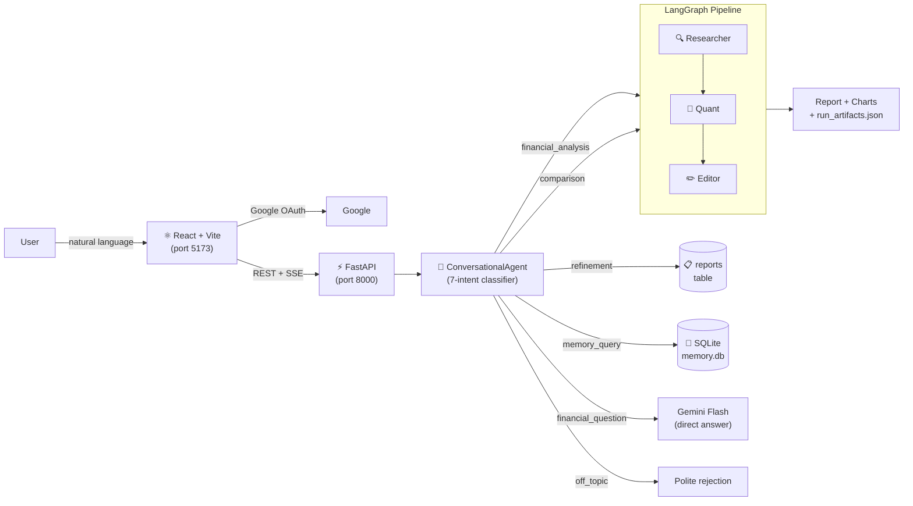

# AI Financial Analyst Agent

A **conversational AI financial analyst** with Google authentication, persistent memory, real-time streaming, interactive charts, and multi-format export. Built on a ReAct + Multi-Agent architecture using LangGraph, Gemini free tier, yfinance, and Tavily.

> **Portfolio project** — demonstrates production-grade agentic AI engineering. Not for real investment decisions.

---

## What it can do

| Say this | What happens |
|---|---|
| *"Analyse AAPL"* | Full pipeline runs → structured report + 3 Plotly charts + PDF/Word/Excel export |
| *"Compare AAPL vs MSFT"* | Both tickers analysed → side-by-side comparison table |
| *"Make the bear case more pessimistic"* | Refinement without re-running the pipeline |
| *"What did we find about AAPL last time?"* | Returns stored summary, no API calls |
| *"I prefer conservative analysis"* | Preference saved, injected into future responses |
| *"What is a P/E ratio?"* | Direct LLM answer, no pipeline |
| Upload a CSV or PDF | Structured summary shown in chat |

---

## Architecture

```
React 19 + Vite  →  FastAPI 0.115  →  ConversationalAgent  →  LangGraph Pipeline
       │                   │                    │                        │
  Google OAuth         JWT cookie           7-intent                Researcher
  SSE streaming        DB migration         routing                 Quant Analyst
  TanStack Query       user_id scope        memory                  Editor
```



---

## Key Engineering Decisions

### No Python REPL
`CalculatorTool` uses `numexpr` with a three-level AST whitelist. Every expression is validated before evaluation. The same principle applies to file uploads — CSV files are parsed to a fixed-schema JSON summary only, no arbitrary pandas operations.

### Prompt Injection Mitigation
All web search output passes through a two-layer sanitisation filter: (1) regex strips known injection patterns, (2) full content blocks are rejected — not partially redacted. A canary token in every system prompt detects successful injection. CSV uploads are checked for formula injection (`=`, `+HYPERLINK`).

### Rate Limit Resilience
`tenacity` exponential backoff + circuit breaker (halts after 3×429 in 30s). Automatic fallback from Gemini Flash to Flash-Lite when rate-limited — analysis continues at reduced quality rather than failing.

### Memory System
SQLite at `.memory/memory.db`: per-user preferences (extracted by Flash-Lite), analysis summaries (generated after each pipeline run), full conversation history. Summaries retrieved by keyword search to inject relevant past context into the system prompt.

### SSE Streaming
`POST /chat/{conv_id}` starts the pipeline in a background asyncio task and returns an `event_id`. `GET /stream/{event_id}` opens an `EventSource` that emits tool-step events in real time, then the final response with chart data and `report_id`.

### Seven-Intent Taxonomy
A dedicated intent for each action prevents false pipeline triggers. `memory_query` stops "What did we find about AAPL?" from re-running the analysis. `comparison` and `refinement` route to specialised handlers that avoid full pipeline re-runs.

---

## Free-Tier Setup

### Prerequisites
- Python 3.11+ · Node.js 18+
- Google AI Studio account (free `GOOGLE_API_KEY`)
- Google Cloud Console project with OAuth 2.0 Client ID
- Tavily account (free `TAVILY_API_KEY` — 1,000 searches/month)
- LangSmith account (free `LANGSMITH_API_KEY`)

### Installation

```bash
git clone <this-repo>
cd ai-financial-analyst
conda activate fin-agent
pip install -e ".[server]"
cp .env.example .env              # fill in all 6 required variables
cd frontend
npm install
cp .env.local.example .env.local  # add VITE_GOOGLE_CLIENT_ID
```

### Google OAuth setup
1. [console.cloud.google.com/apis/credentials](https://console.cloud.google.com/apis/credentials) → Create OAuth 2.0 Client ID → Web application
2. Authorised JavaScript origins: `http://localhost:5173`
3. Copy Client ID → `.env` (`GOOGLE_CLIENT_ID`) and `frontend/.env.local` (`VITE_GOOGLE_CLIENT_ID`)
4. Copy Client Secret → `.env` (`GOOGLE_CLIENT_SECRET`)
5. Generate JWT secret: `python -c "import secrets; print(secrets.token_hex(32))"` → `FASTAPI_JWT_SECRET`

### Run

```bash
# Terminal 1 — backend
uvicorn backend.main:app --reload --port 8000

# Terminal 2 — frontend
cd frontend && npm run dev
# Open http://localhost:5173
```

---

## Running Tests

```bash
pytest tests/unit/ tests/integration/ tests/adversarial/ -v
cd frontend && npm run build      # zero TypeScript errors required
```

---

## Project Structure

```
ai_financial_analyst/
  agents/
    conversational_agent.py   Top-level router (7 intents)
    intent_classifier.py      Flash-Lite JSON classifier
    comparison_agent.py       Side-by-side comparison table
    refinement_handler.py     LLM-guided report modification
    researcher.py / quant_analyst.py / editor.py / orchestrator.py
  core/
    llm.py                    Gemini client: retry + circuit breaker + fallback
    state.py / conversation_state.py   AgentState + ConversationState TypedDicts
    sanitizer.py              Injection filter + canary token
    budget_tracker.py / cache.py / tracing.py / artifacts.py
  memory/
    long_term.py              SQLite: preferences, summaries, conversations, messages, feedback
    memory_manager.py         Facade: context injection, preference extraction, summary saving
    short_term.py             Token-budget context window
  tools/
    yahoo_finance.py / web_search.py / calculator.py / benchmark_lookup.py / report_writer.py
    chart_generator.py        Plotly JSON charts (price, P/E, financials)
    file_parser.py            CSV + PDF upload parsing
    pdf_exporter.py / docx_exporter.py / xlsx_exporter.py

backend/
  main.py                     FastAPI app, CORS, lifespan DB migration
  routers/
    auth.py                   Google OAuth → JWT httpOnly cookie
    chat.py                   POST /chat → event_id; GET /stream → SSE
    conversations.py          CRUD + message history
    files.py                  POST /files/upload; POST /export/{pdf,docx,xlsx}
    memory.py                 Preferences + summaries CRUD
    feedback.py               POST /feedback (👍/👎)
  core/
    auth.py / database.py / session_manager.py / event_store.py / deps.py

frontend/
  src/
    pages/          LoginPage, ChatPage
    components/
      chat/         ChatInterface, ChatBubble, MessageInput, FileUploadZone
                    ExportMenu, ProvenancePanel
      sidebar/      ConversationList, MemoryPanel
      PlotlyChart.tsx
    hooks/          useAuth, useStreamingChat
    lib/            api.ts (typed fetch wrappers), constants.ts

tests/              unit / integration / adversarial / e2e
docs/
  ROADMAP.md        Implementation history and phase summaries
  MANUAL_TESTING.md Complete manual testing guide
```

---

## Known Limitations

| Limitation | Notes |
|---|---|
| Gemini free tier: ~1,500 RPD, 15 RPM | Auto-fallback to Flash-Lite on rate limit |
| yfinance data lag (~15 min) | `data_timestamp` field makes this explicit |
| Tavily: 1,000 credits/month | 4-hour diskcache reduces consumption |
| Static sector benchmarks | Approximate 2024 P/E averages — relative comparison only |
| Sequential pipeline (~60–120s / 2–3 tickers) | Required to stay within free-tier RPM cap |
| PDF export requires weasyprint | `pip install weasyprint`; may need `brew install pango` on macOS |
| Single-process FastAPI sessions | Fine for local/demo; Redis needed for horizontal scaling |

---

## Security

- No secrets committed — all credentials in `.env` (gitignored)
- No Python REPL — constrained `numexpr` evaluator only
- Prompt injection filter on all web search content; CSV formula injection scrubbed
- Canary token detection in agent output
- All tool inputs validated with Pydantic v2 `extra='forbid'`
- JWT in httpOnly cookie (not accessible to JavaScript)
- Per-user data isolation via `user_id` scoping on all SQLite queries

---

*DISCLAIMER: Portfolio and educational purposes only. Generated reports should not be used for real investment decisions. This is not financial advice.*
