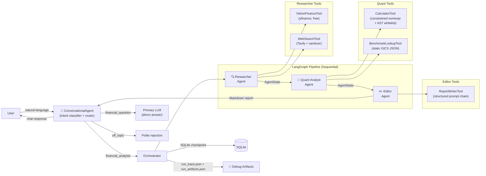

# AI Financial Analyst Agent

A **conversational AI financial analyst** built on the **ReAct + Multi-Agent** architecture using **LangGraph**, **Gemini free tier**, **yfinance**, and **Tavily**. Zero ongoing API cost.

Accepts natural language queries — no fixed ticker form. Autonomously classifies intent, routes requests, and runs a structured multi-agent pipeline to produce research-grade reports.

> **Portfolio project** — demonstrates production-grade agentic AI engineering patterns. Not for real financial decisions.

---

## Architecture



---

## Model Choices

| Role | Model | Rationale |
|------|-------|-----------|
| Core ReAct reasoning | `gemini-3-flash-preview` | Best free-tier model for tool-calling accuracy and complex JSON output |
| Sanitisation sub-tasks | `gemini-3.1-flash-lite-preview` | 2–3× faster than Flash; sufficient for structured extraction; conserves RPM quota |

> `gemini-2.0-flash` and `gemini-2.0-flash-lite` are deprecated and shut down June 1, 2026.

---

## Key Engineering Decisions

### No Python REPL
The `CalculatorTool` uses `numexpr` with an **AST whitelist**, not a general-purpose REPL. Every LLM-generated expression is parsed with `ast.parse()` and validated against a strict whitelist of safe node types before evaluation. This prevents arbitrary code execution even in a local portfolio context.

### Prompt Injection Mitigation
All `WebSearchTool` output passes through a **sanitization filter** before reaching the agent:
1. Tavily returns pre-summarised, structured results (no raw HTML) — significantly reducing the attack surface.
2. Regex pre-filter strips known imperative injection patterns from every result field.

A canary token in every system prompt detects if injected instructions reach agent output.

### Rate Limit Resilience
Every Gemini API call is wrapped with `tenacity` exponential backoff + jitter (2s base, 60s max, 5 retries). A **circuit breaker** halts the pipeline after 3 consecutive 429s within 30 seconds, producing a partial report rather than burning quota in an infinite retry loop.

### Financial Data Hallucination Prevention
The Editor agent runs a **grounding check**: every quantitative claim in the report must be traceable to a tool observation in the `iteration_log`. Ungrounded figures are tagged `[UNVERIFIED]` and removed.

---

## Free-Tier Setup

### Prerequisites
- Python 3.11+
- A [Google AI Studio](https://aistudio.google.com/apikey) account (free `GOOGLE_API_KEY`)
- A [Tavily](https://app.tavily.com/sign-in) account (free `TAVILY_API_KEY` — 1,000 searches/month)
- A [LangSmith](https://smith.langchain.com) account (free `LANGSMITH_API_KEY`, for tracing)

### Installation

```bash
git clone <this-repo>
cd ai-financial-analyst
pip install -e ".[dev]"
cp .env.example .env
# Edit .env: fill in GOOGLE_API_KEY, TAVILY_API_KEY, and LANGSMITH_API_KEY
```

### Run

```bash
# Install Python deps (including FastAPI server)
pip install -e ".[server]"

# Terminal 1 — FastAPI backend
uvicorn backend.main:app --reload --port 8000

# Terminal 2 — React frontend
cd frontend && npm install && npm run dev
# Open http://localhost:5173
```

Sign in with Google → start chatting. Say *"Analyse AAPL"* for a full pipeline run, or *"What is CAGR?"* for a direct answer. Past analyses are remembered across sessions.

**Legacy Streamlit UI** (dry-run demos only):
```bash
streamlit run ui/app.py   # Classic form with dry-run replay
```

### Demo without API calls (dry-run)

After a real run, download the `run_trace.json` from the chat or the classic UI. Then in the classic UI:

1. Check the **Dry-run mode** checkbox in the sidebar
2. Upload your `run_trace.json`

The full Thought / Action / Observation stream replays with zero API calls — ideal for interview demos.

---

## Running Tests

```bash
# Unit tests
pytest tests/unit/ -v --cov=ai_financial_analyst --cov-report=term-missing

# Integration tests
pytest tests/integration/ -v

# E2E tests (pre-recorded cassettes, zero live API quota)
pytest tests/e2e/ -v

# Adversarial / security tests
pytest tests/adversarial/ -v

# Full suite
pytest -v
```

---

## Known Limitations

| Limitation | Impact | Notes |
|-----------|--------|-------|
| Gemini free tier: ~1,500 RPD, 15 RPM | Pipeline stalls on heavy usage | `RequestBudgetTracker` warns at 80% |
| yfinance data lag | Prices may be 15 min delayed | `data_timestamp` field makes this explicit |
| Tavily free tier: 1,000 searches/month | Occasional cache reliance | 4-hour diskcache reduces consumption |
| Static benchmark data | Sector P/E averages are approximate 2024 values | Not live — use only for relative comparison |
| Sequential execution | Each run takes 60–120s for 2–3 tickers | Required to stay within free-tier RPM cap |
| No multi-user support yet | All data is local, single-user | Phase 4A adds Google Sign-In and per-user isolation |

---

## Project Structure

```
ai_financial_analyst/
├── core/
│   ├── llm.py               # Gemini client: retry + circuit breaker + Flash-Lite fallback
│   ├── state.py             # AgentState TypedDict (inner pipeline contract)
│   ├── conversation_state.py # ConversationState TypedDict (chat layer)
│   ├── cache.py             # diskcache 4-hour TTL
│   ├── budget_tracker.py    # Free-tier API call counter + model degradation flag
│   ├── tracing.py           # run_trace.json builder + LangSmith
│   ├── artifacts.py         # Full API/LLM response storage
│   └── sanitizer.py         # Injection filter + canary token
├── memory/
│   ├── long_term.py         # SQLite: preferences, summaries, conversations, messages
│   ├── memory_manager.py    # Facade: context injection, preference extraction, summary saving
│   └── short_term.py        # Token-budget context window (stateless)
├── tools/                   # Five LangChain tools with Pydantic v2 schemas
├── agents/
│   ├── conversational_agent.py  # Top-level chat agent (5-intent router + memory query)
│   ├── intent_classifier.py     # Flash-Lite classifier; 5 intents incl. memory_query
│   ├── researcher.py            # yfinance + Tavily; max 5 iter/ticker
│   ├── quant_analyst.py         # CAGR, P/E vs benchmark, bull/bear
│   ├── editor.py                # SOP rubric + grounding check
│   └── orchestrator.py          # LangGraph pipeline + SQLite checkpoint
└── data/
    └── benchmarks.json      # Static GICS sector P/E averages
ui/
├── chat_app.py              # Conversational chat UI (recommended)
└── app.py                   # Classic form UI with dry-run replay
tests/
├── unit/                    # Tool-level + classifier tests, mocked APIs
├── integration/             # Per-agent + conversational agent tests
├── e2e/                     # Full pipeline, VCR cassettes
└── adversarial/             # Prompt injection payload tests
debug_artifacts/             # Per-run trace + artifact JSON (gitignored)
```

---

## Security Notes

- No secrets committed — all credentials via `.env` (`.env.example` provided)
- No Python REPL anywhere in the codebase — constrained `numexpr` only
- Prompt injection filter on all web-scraped content
- Canary token detection in agent output
- All tool inputs validated with `pydantic v2` `extra='forbid'`

---

*DISCLAIMER: This project is for portfolio and educational purposes only. All generated reports are AI-produced and should not be used for real investment decisions. This is not financial advice.*
