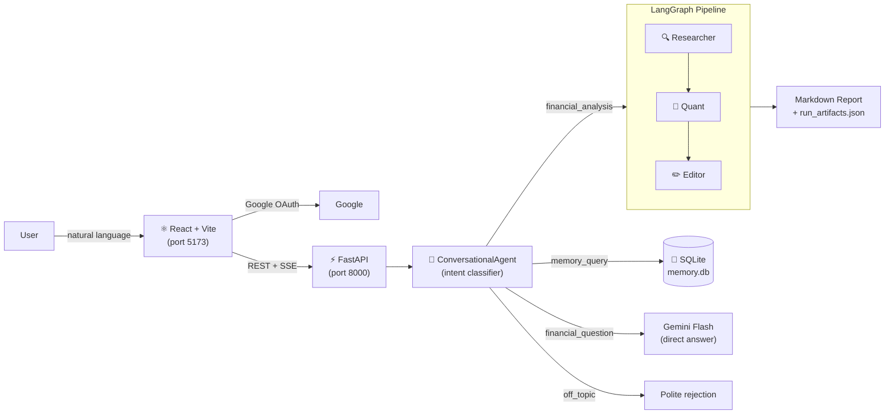

# AI Financial Analyst Agent

A **conversational AI financial analyst** with Google authentication, persistent memory, and real-time streaming. Built on a ReAct + Multi-Agent architecture using LangGraph, Gemini free tier, yfinance, and Tavily.

> **Portfolio project** — demonstrates production-grade agentic AI engineering. Not for real investment decisions.

---

## Architecture

```
React 19 + Vite  →  FastAPI 0.115  →  ConversationalAgent  →  LangGraph Pipeline
       │                   │                    │                        │
  Google OAuth         JWT cookie           5-intent                Researcher
  SSE streaming        DB migration         routing                 Quant Analyst
  TanStack Query       user_id scope        memory                  Editor
```



---

## Key Engineering Decisions

### No Python REPL
`CalculatorTool` uses `numexpr` with a three-level AST whitelist. Every expression is validated before evaluation. Prevents arbitrary code execution.

### Prompt Injection Mitigation
All web search output passes through a two-layer sanitization filter: (1) regex strips known injection patterns, (2) full content blocks are rejected — not partially redacted. A canary token in every system prompt detects successful injection.

### Rate Limit Resilience
`tenacity` exponential backoff + circuit breaker (halts after 3×429 in 30s). Automatic fallback from Gemini Flash to Flash-Lite on rate limit — analysis continues at reduced quality rather than failing.

### Memory System
SQLite at `.memory/memory.db`: per-user preferences (extracted by Flash-Lite from natural language), analysis summaries (generated after each pipeline run), full conversation history. Summaries are retrieved by LIKE search to inject relevant past context into the system prompt.

### SSE Streaming
`POST /chat/{conv_id}` starts the pipeline in a background asyncio task and returns an `event_id`. `GET /stream/{event_id}` opens an `EventSource` that emits tool-step events in real time, followed by the final response.

---

## Free-Tier Setup

### Prerequisites
- Python 3.11+ · Node.js 18+
- Google AI Studio account (free `GOOGLE_API_KEY`)
- Google Cloud Console project with OAuth 2.0 Client ID
- Tavily account (free `TAVILY_API_KEY` — 1,000 searches/month)
- LangSmith account (free `LANGSMITH_API_KEY`)

### Installation

```bash
git clone <this-repo>
cd ai-financial-analyst
conda activate fin-agent          # or: python -m venv .venv && source .venv/bin/activate
pip install -e ".[server]"
cp .env.example .env              # fill in all 6 required variables
cd frontend
npm install
cp .env.local.example .env.local  # add VITE_GOOGLE_CLIENT_ID
```

### Google OAuth setup
1. Go to [console.cloud.google.com/apis/credentials](https://console.cloud.google.com/apis/credentials)
2. Create OAuth 2.0 Client ID → Web application
3. Authorised JavaScript origins: `http://localhost:5173`
4. Copy Client ID → `.env` (`GOOGLE_CLIENT_ID`) and `frontend/.env.local` (`VITE_GOOGLE_CLIENT_ID`)
5. Copy Client Secret → `.env` (`GOOGLE_CLIENT_SECRET`)
6. Generate JWT secret: `python -c "import secrets; print(secrets.token_hex(32))"`  → `FASTAPI_JWT_SECRET`

### Run

```bash
# Terminal 1 — backend
uvicorn backend.main:app --reload --port 8000

# Terminal 2 — frontend
cd frontend && npm run dev
# Open http://localhost:5173
```

Sign in with Google → start chatting. Say *"Analyse AAPL"* for a full pipeline run, or *"What did we find about AAPL?"* to recall a past analysis.

---

## Running Tests

```bash
pytest tests/unit/ tests/integration/ tests/adversarial/ -v
cd frontend && npm run build      # zero TypeScript errors required
```

---

## Project Structure

```
ai_financial_analyst/          Python package (AI pipeline)
  agents/                      ConversationalAgent, intent classifier, pipeline nodes
  core/                        LLM client, state, cache, budget tracker, sanitizer
  memory/                      SQLite memory (long-term, short-term, manager)
  tools/                       Five LangChain tools (yahoo_finance, web_search, etc.)
  data/benchmarks.json         Static GICS sector P/E averages

backend/                       FastAPI application
  main.py                      App, CORS, DB migration on startup
  routers/                     auth, conversations, chat (SSE), memory
  core/                        JWT auth, session manager, event store, DB

frontend/                      React + Vite SPA
  src/pages/                   LoginPage, ChatPage
  src/components/              ChatInterface, ChatBubble, ConversationList, MemoryPanel
  src/hooks/                   useAuth, useStreamingChat
  src/lib/                     Typed API client, constants

ui/                            Streamlit UIs (archived — dry-run replay only)
tests/                         unit / integration / adversarial / e2e
docs/ROADMAP.md                Implementation roadmap
```

---

## Known Limitations

| Limitation | Notes |
|---|---|
| Gemini free tier: ~1,500 RPD, 15 RPM | Auto-fallback to Flash-Lite on rate limit |
| yfinance data lag (~15 min) | `data_timestamp` field makes this explicit |
| Tavily: 1,000 credits/month | 4-hour diskcache reduces consumption |
| Static sector benchmarks | Approximate 2024 P/E averages — relative comparison only |
| Sequential pipeline (~60–120s for 2–3 tickers) | Required to stay within free-tier RPM cap |
| Single-process FastAPI sessions | Fine for local/demo; migrate to Redis for horizontal scaling |

---

## Security

- No secrets committed — all credentials in `.env` (gitignored)
- No Python REPL — constrained `numexpr` evaluator only
- Prompt injection filter on all web search content
- Canary token detection in agent output
- All tool inputs validated with Pydantic v2 `extra='forbid'`
- JWT in httpOnly cookie (not accessible to JavaScript)
- Per-user data isolation via `user_id` scoping on all SQLite queries

---

*DISCLAIMER: Portfolio and educational purposes only. Generated reports should not be used for real investment decisions. This is not financial advice.*
