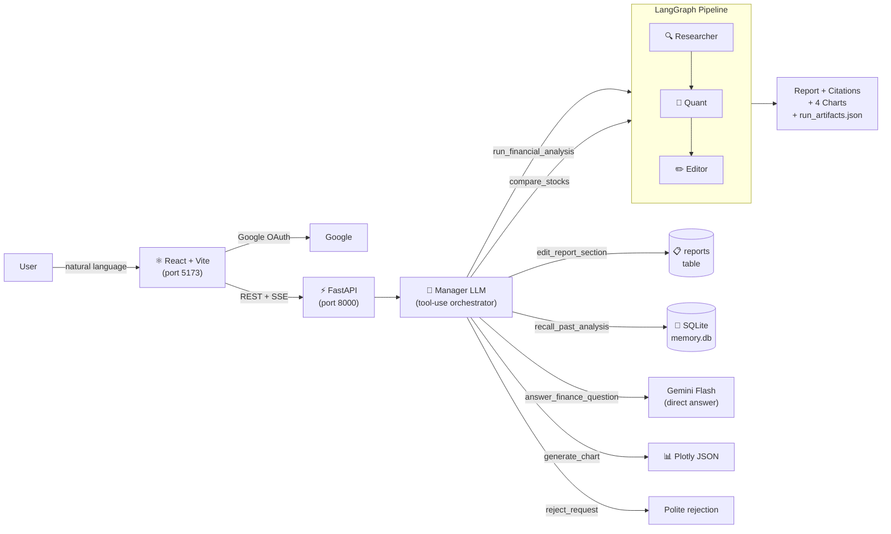

# AI Financial Analyst Agent

A **conversational AI financial analyst** with Google authentication, persistent memory, real-time streaming, interactive charts, multi-format export, surgical report editing, and an intelligent tool-use orchestrator. Built on a ReAct + Multi-Agent architecture using LangGraph, Gemini free tier, yfinance, and Tavily.

> **Portfolio project** — demonstrates production-grade agentic AI engineering. Not for real investment decisions.

---

## What it can do

| Say this | What happens |
|---|---|
| *"Analyse AAPL"* | Full pipeline → report + 4 Plotly charts + PDF/Word/Excel export |
| *"Compare AAPL vs MSFT"* | Both tickers analysed → side-by-side comparison table |
| *"Make the bear case more pessimistic"* | Surgical str_replace edit — only that section changes |
| *"Show me a chart of AAPL's financial profile"* | On-demand radar chart generated |
| *"What did we find about AAPL last time?"* | Returns stored summary, no API calls |
| *"I prefer conservative analysis"* | Preference saved, injected into future responses |
| *"Analyse AAPL, then compare with MSFT"* | Manager chains both tools in one message |
| Upload XLSX, DOCX, PDF, CSV, TXT, MD, JSON | Full-document hierarchical summary in chat |

---

## Architecture

```
React 19 + Vite  →  FastAPI 0.115  →  Manager LLM (tool-use)  →  LangGraph Pipeline
       │                   │                    │                        │
  Google OAuth         JWT cookie           8 tools                 Researcher
  SSE streaming        DB migration         auto-routing            Quant Analyst
  Citation badges      user_id scope        memory context          Editor
```



---

## Key Engineering Decisions

### Manager LLM Orchestrator (replaces hardcoded intent classifier)
The Manager uses LangChain `bind_tools` (function-calling) to autonomously decide which tool(s) to call, in what order. Handles compound requests ("Analyse AAPL then compare with MSFT") and adds new capabilities by simply registering a new `@tool` — no routing changes needed.

### str_replace Surgical Document Editing
When refining a report, the LLM receives the **full** document and outputs `old_string` + `new_string`. A literal string replacement is applied — unchanged sections are preserved character-perfect. If the LLM hallucinates text not in the document, the handler retries with a corrective prompt.

### Hierarchical Document Summarisation
Large documents (PDF, DOCX, TXT) are split into overlapping 3,000-char chunks, each summarised by Flash-Lite, then combined. No truncation — important context is preserved regardless of document length.

### Citation System
`(Source: fundamentals)` inline citations are parsed into numbered `[N]` superscript badges with click/hover popovers. Each source shows a always-visible link (Yahoo Finance, Reuters, Bloomberg, etc. — parsed from actual URLs). A References section at the bottom lists all citations.

### No Python REPL
`CalculatorTool` uses `numexpr` with an AST whitelist. File parsers produce fixed-schema JSON summaries only — no raw user data reaches the LLM, no arbitrary code execution.

### Rate Limit Resilience
`tenacity` retry + circuit breaker (3×429 in 30s). Automatic fallback from Gemini Flash to Flash-Lite — analysis continues at reduced quality rather than failing.

---

## Free-Tier Setup

### Prerequisites
- Python 3.11+ · Node.js 18+
- Google AI Studio account (free `GOOGLE_API_KEY`)
- Google Cloud Console project with OAuth 2.0 Client ID
- Tavily account (free `TAVILY_API_KEY` — 1,000 searches/month)
- LangSmith account (free `LANGSMITH_API_KEY`)

### Installation

```bash
git clone <this-repo>
cd ai-financial-analyst
conda activate fin-agent
pip install -e ".[server]"
cp .env.example .env              # fill in all 6 required variables
cd frontend
npm install
cp .env.local.example .env.local  # add VITE_GOOGLE_CLIENT_ID
```

### Google OAuth setup
1. [console.cloud.google.com/apis/credentials](https://console.cloud.google.com/apis/credentials) → Create OAuth 2.0 Client ID → Web application
2. Authorised JavaScript origins: `http://localhost:5173`
3. Copy Client ID → `.env` (`GOOGLE_CLIENT_ID`) and `frontend/.env.local` (`VITE_GOOGLE_CLIENT_ID`)
4. Copy Client Secret → `.env` (`GOOGLE_CLIENT_SECRET`)
5. Generate JWT secret: `python -c "import secrets; print(secrets.token_hex(32))"` → `FASTAPI_JWT_SECRET`

### Run

```bash
# Terminal 1 — backend
uvicorn backend.main:app --reload --port 8000

# Terminal 2 — frontend
cd frontend && npm run dev
# Open http://localhost:5173
```

---

## Running Tests

```bash
pytest tests/unit/ tests/integration/ tests/adversarial/ -v
cd frontend && npm run build      # zero TypeScript errors required
```

---

## Project Structure

```
ai_financial_analyst/
  agents/
    manager.py               Tool-use LLM orchestrator (8 tools, bind_tools loop)
    conversational_agent.py  Session wrapper; delegates to Manager
    comparison_agent.py      Multi-ticker pipeline + comparison table
    refinement_handler.py    str_replace surgical report editing
    researcher.py / quant_analyst.py / editor.py / orchestrator.py
  core/
    llm.py                   Gemini client: retry + circuit breaker + Flash-Lite fallback
    state.py / conversation_state.py
    sanitizer.py             Injection filter + canary token
    budget_tracker.py / cache.py / tracing.py / artifacts.py
  memory/
    long_term.py             SQLite: preferences, summaries, conversations, messages, reports
    memory_manager.py        Facade: context injection, preference extraction, summary saving
    short_term.py            Token-budget context window
  tools/
    yahoo_finance.py / web_search.py / calculator.py / benchmark_lookup.py / report_writer.py
    chart_generator.py       Plotly JSON: price, P/E, financials, radar
    file_parser.py           8 formats with hierarchical Flash-Lite summarisation
    pdf_exporter.py / docx_exporter.py / xlsx_exporter.py (with live CAGR formulas)

backend/
  main.py                    FastAPI app, CORS, lifespan DB migration
  routers/
    auth.py / conversations.py / chat.py / files.py / memory.py / feedback.py
  core/
    auth.py / database.py / session_manager.py / event_store.py / deps.py

frontend/
  src/
    pages/          LoginPage, ChatPage (collapsible sidebar rail)
    components/
      chat/         ChatInterface (Gemini-style empty state), ChatBubble (fade-in, SVG avatar)
                    MessageInput (violet send button), FileUploadZone (8 formats)
                    CitationRenderer (numbered badges + popovers + References)
                    ExportMenu, ProvenancePanel
      sidebar/      ConversationList, MemoryPanel (natural-language preferences)
      PlotlyChart.tsx (lazy-loaded, code-split)
    hooks/          useAuth, useStreamingChat
    lib/            api.ts (typed fetch wrappers), constants.ts

tests/              unit / integration / adversarial / e2e
docs/
  MANUAL_TESTING.md  Complete manual testing guide (15 sections)
```

---

## Known Limitations

| Limitation | Notes |
|---|---|
| Gemini free tier: ~1,500 RPD, 15 RPM | Auto-fallback to Flash-Lite on rate limit |
| yfinance data lag (~15 min) | `data_timestamp` field makes this explicit |
| Tavily: 1,000 credits/month | 4-hour diskcache reduces consumption |
| Static sector benchmarks | Approximate 2024 P/E averages — relative comparison only |
| Sequential pipeline (~60–120s / 2–3 tickers) | Required to stay within free-tier RPM cap |
| PDF export requires weasyprint | `pip install weasyprint`; macOS may need `brew install pango` |
| Single-process FastAPI sessions | Fine for local/demo; Redis needed for horizontal scaling |

---

## Security

- No secrets committed — all credentials in `.env` (gitignored)
- No Python REPL — constrained `numexpr` only; file parsers produce fixed-schema summaries
- Prompt injection filter on all web search content; CSV/XLSX formula injection scrubbed
- Canary token detection in agent output
- All tool inputs validated with Pydantic v2 `extra='forbid'`
- JWT in httpOnly cookie (not accessible to JavaScript)
- Per-user data isolation via `user_id` scoping on all SQLite queries

---

*DISCLAIMER: Portfolio and educational purposes only. Generated reports should not be used for real investment decisions. This is not financial advice.*
