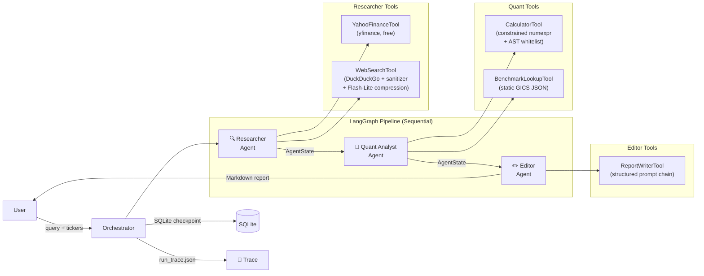

# AI Financial Analyst Agent

An autonomous financial research agent built on the **ReAct + Multi-Agent** architecture using **LangGraph**, **Gemini free tier**, **yfinance**, and **DuckDuckGo**. Zero ongoing API cost.

> **Portfolio project** — demonstrates production-grade agentic AI engineering patterns. Not for real financial decisions.

---

## Architecture



---

## Model Choices

| Role | Model | Rationale |
|------|-------|-----------|
| Core ReAct reasoning | `gemini-3-flash-preview` | Best free-tier model for tool-calling accuracy and complex JSON output |
| Sanitisation sub-tasks | `gemini-3.1-flash-lite-preview` | 2–3× faster than Flash; sufficient for structured extraction; conserves RPM quota |

> `gemini-2.0-flash` and `gemini-2.0-flash-lite` are deprecated and shut down June 1, 2026.

---

## Key Engineering Decisions

### No Python REPL
The `CalculatorTool` uses `numexpr` with an **AST whitelist**, not a general-purpose REPL. Every LLM-generated expression is parsed with `ast.parse()` and validated against a strict whitelist of safe node types before evaluation. This prevents arbitrary code execution even in a local portfolio context.

### Prompt Injection Mitigation
All `WebSearchTool` output passes through a **sanitization filter** before reaching the agent:
1. Tavily returns pre-summarised, structured results (no raw HTML) — significantly reducing the attack surface.
2. Regex pre-filter strips known imperative injection patterns from every result field.

A canary token in every system prompt detects if injected instructions reach agent output.

### Rate Limit Resilience
Every Gemini API call is wrapped with `tenacity` exponential backoff + jitter (2s base, 60s max, 5 retries). A **circuit breaker** halts the pipeline after 3 consecutive 429s within 30 seconds, producing a partial report rather than burning quota in an infinite retry loop.

### Financial Data Hallucination Prevention
The Editor agent runs a **grounding check**: every quantitative claim in the report must be traceable to a tool observation in the `iteration_log`. Ungrounded figures are tagged `[UNVERIFIED]` and removed.

---

## Free-Tier Setup

### Prerequisites
- Python 3.11+
- A [Google AI Studio](https://aistudio.google.com/apikey) account (free `GOOGLE_API_KEY`)
- A [Tavily](https://app.tavily.com/sign-in) account (free `TAVILY_API_KEY` — 1,000 searches/month)
- A [LangSmith](https://smith.langchain.com) account (free `LANGSMITH_API_KEY`, for tracing)

### Installation

```bash
git clone <this-repo>
cd ai-financial-analyst
pip install -e ".[dev]"
cp .env.example .env
# Edit .env: fill in GOOGLE_API_KEY, TAVILY_API_KEY, and LANGSMITH_API_KEY
```

### Run

```bash
streamlit run ui/app.py
```

Enter tickers like `AAPL, NVDA` and click **Run Analysis**.

### Demo without API calls (--dry-run)

After a real run, download the `run_trace.json` file. Then:

1. Check the **Dry-run mode** checkbox in the sidebar
2. Upload your `run_trace.json`

The full Thought / Action / Observation stream replays with zero API calls — ideal for interview demos.

---

## Running Tests

```bash
# Unit tests
pytest tests/unit/ -v --cov=ai_financial_analyst --cov-report=term-missing

# Integration tests
pytest tests/integration/ -v

# E2E tests (pre-recorded cassettes, zero live API quota)
pytest tests/e2e/ -v

# Adversarial / security tests
pytest tests/adversarial/ -v

# Full suite
pytest -v
```

---

## Known Limitations

| Limitation | Impact | Notes |
|-----------|--------|-------|
| Gemini free tier: ~1,500 RPD, 15 RPM | Pipeline stalls on heavy usage | `RequestBudgetTracker` warns at 80% |
| yfinance data lag | Prices may be 15 min delayed | `data_timestamp` field makes this explicit |
| DuckDuckGo rate limiting | Occasional empty search results | Tool returns structured null; agent notes gap |
| Static benchmark data | Sector P/E averages are approximate 2024 values | Not live — use only for relative comparison |
| Sequential execution | Each run takes 60–120s for 2–3 tickers | Required to stay within free-tier RPM cap |

---

## Project Structure

```
ai_financial_analyst/
├── core/           # LLM client, state, cache, tracing, sanitizer
├── tools/          # Five LangChain tools with Pydantic v2 schemas
├── agents/         # Researcher, Quant Analyst, Editor + LangGraph orchestrator
└── data/           # benchmarks.json (static GICS sector data)
ui/
└── app.py          # Streamlit UI with streaming + dry-run
tests/
├── unit/           # Tool-level tests, mocked APIs
├── integration/    # Per-agent tests, mocked LLM
├── e2e/            # Full pipeline, VCR cassettes
└── adversarial/    # Prompt injection payload tests
```

---

## Security Notes

- No secrets committed — all credentials via `.env` (`.env.example` provided)
- No Python REPL anywhere in the codebase — constrained `numexpr` only
- Prompt injection filter on all web-scraped content
- Canary token detection in agent output
- All tool inputs validated with `pydantic v2` `extra='forbid'`

---

*DISCLAIMER: This project is for portfolio and educational purposes only. All generated reports are AI-produced and should not be used for real investment decisions. This is not financial advice.*
